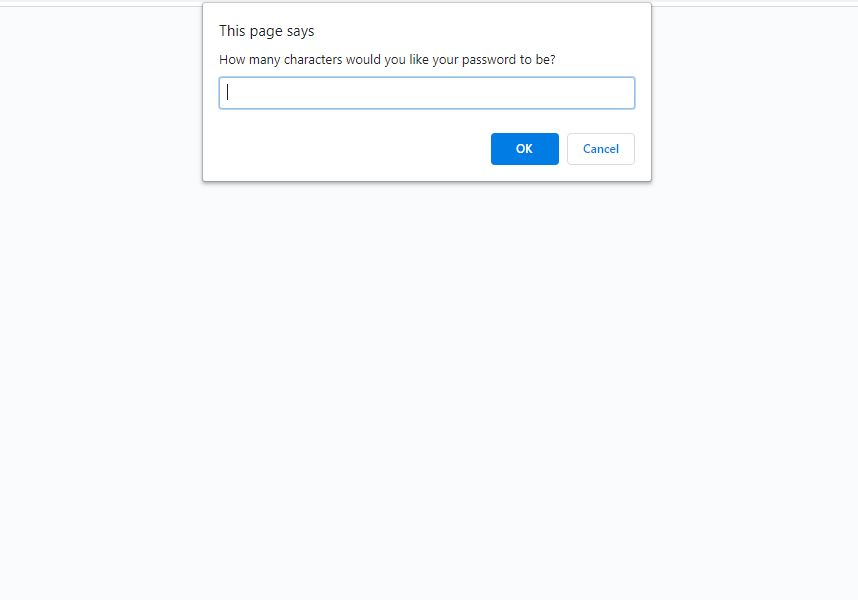
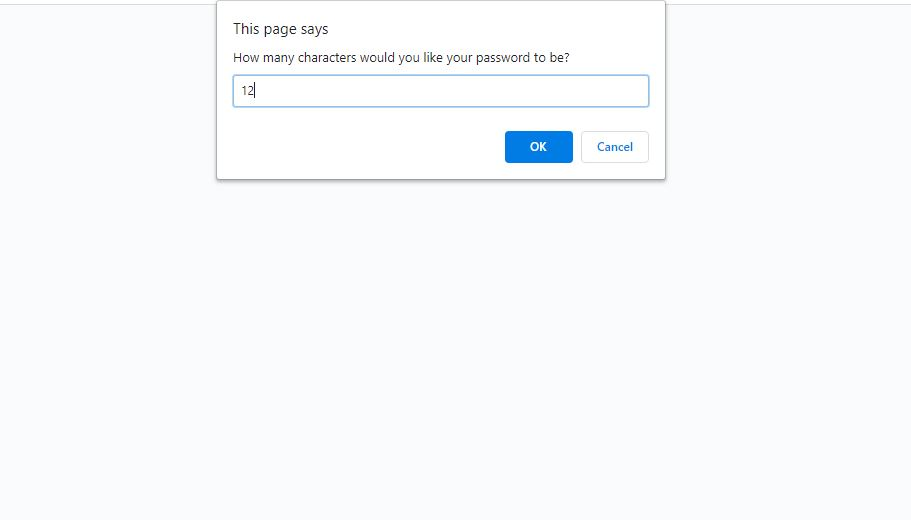
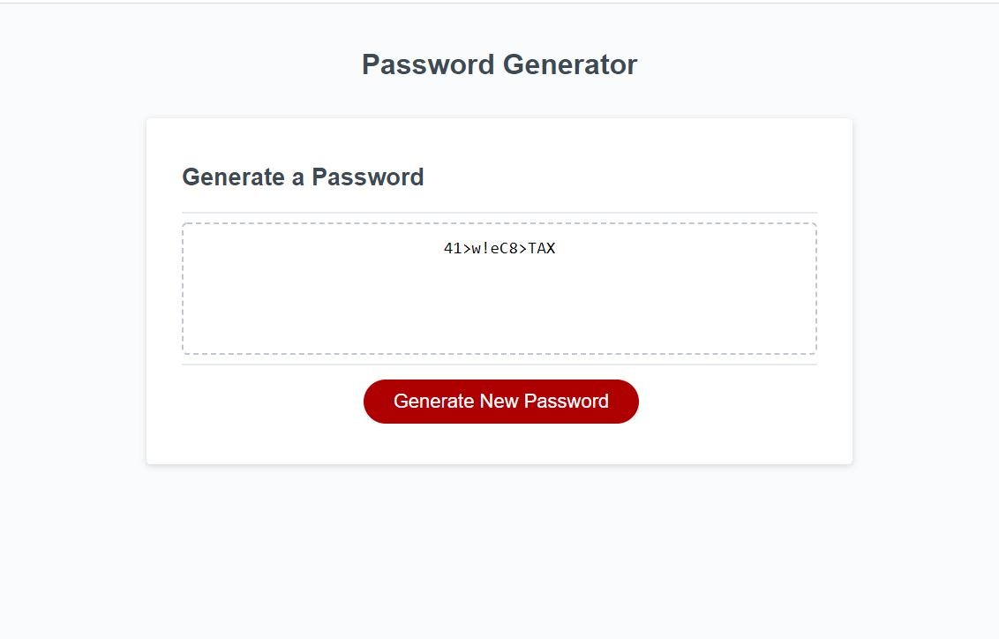

# Password Generator

## Subject: Responsive Password Generator

## Description:
This repo is to create an application that will generate password using multiple parameters. When the prompt ask you: "How many characters would you like your password to be? ", you must entre a number between 8 and 128. 8 and 128 are included themselve. After that number input, you will be asked a series of question about whatever upper,numbers, special characters, lowercase characters you want in your password.When all answers are given, the application will go head and print the password on the screen. But if you don't like the generated password, you can still generate a new one without running the app again.

### See Website
[Click Here](https://lemanou7.github.io/myPasswordGenerator/) to see the application.


### Installation


<!-- GETTING STARTED -->

This is some useful steps, you must meet to run this page correctly 

### Prerequisites
You can use any code editor of your choise, i use Vs Code because it is open source and it understand git and do syntax highlighting very nicely.

* Go to
  [Click Here](https://code.visualstudio.com/download) to download Vs Code to your computer.
  

1. Clone the repo
   ```sh
   git clone  https://github.com/lemanou7/myPasswordGenerator
   ```
2. Get a linux shell emulator like Git bash or Powershell then:
    ```sh
    cd to where your repository folder is located in your computer
    ```
3. Run the html file by entering this command if using Vs Code

   ```sh
      code index.html
   ```

4. Run the html file by entering this command if using Vs Code
   ```sh
   code index.html
   ```
   Right Click and Click on the option: "Open in Defauld Browser" or Alt B


### See Website Screenshots

5. Full Webpage 



5. Testing With 12 elemants Password



5. Password Generation Page




<!-- CONTACT -->
## Contact

Drissa Bagate (<span style="color:#5ddcf0">**Django, Javascript Full Stack Developer**</span>) [GitHub](https://github.com/lemanou7) - lemanou7@yahoo.fr

Other Project link: [My Blog Post Python-Django Implemation](http://grandbuzz.herokuapp.com/)

